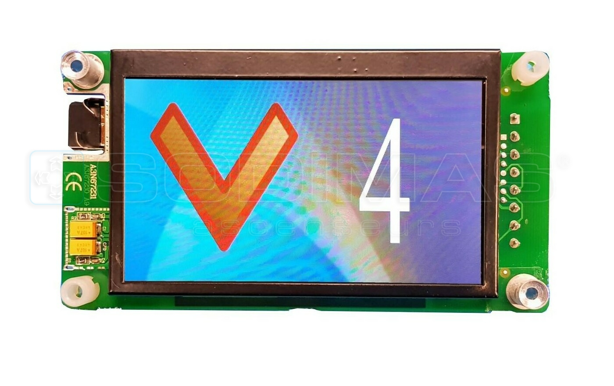

<!--  -->

# Projet: Utilisation d'un écran LCD en CAN avec MBED

## Description
Ce projet implémente une classe permettant de contrôler un l'écran LCD (16x2) via le protocole CAN (Controller Area Network) en utilisant la plateforme MBED. L'objectif est de faciliter l'utilisation de l'écran LCD.

## Fonctionnalités
- Ecriture sur l'écran LCD en CAN
- Position du curseur (en x et y)
- Effacer l'écran 

## Utilisation
- Inclure le fichier **lcd_can.h** dans le dossier **include**
- Ajouter le fichier **lcd_can.cpp** dans le dossier **src**

## Exemple de code
```cpp

#include "lcd_can.h"

LCD_CAN lcd;
int val = 10;
int main()
{
    while(true)
    {
        lcd.setCursor(); // x=0, y=0
        lcd.print("Valeur: %d", 10);
        lcd.clear();
        lcd.setCursor(1, 1);
        lcd.print("Valeur: %d", val);
        lcd.clear();
        lcd.setCursor(1, 1);
        lcd.print("Hello %s", "world");
    }
}
```